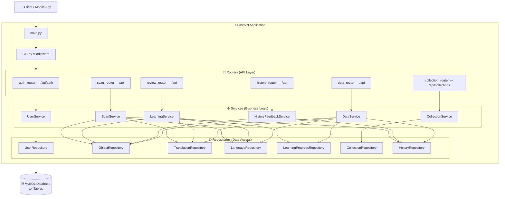
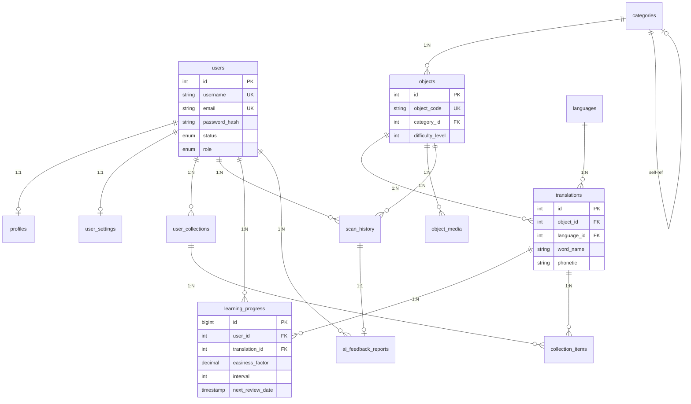

# 🗺️ Object Language App — Backend Architecture

> Auto-generated by /map on 2026-03-10

## Overview

API Backend cho ứng dụng nhận diện vật thể đa ngôn ngữ. Người dùng quét vật thể → hệ thống tra cứu/tạo bản dịch đa ngôn ngữ → ôn tập từ vựng qua thuật toán SM-2 (Spaced Repetition).

---

## Components

### Routers (API Layer)
- **Purpose:** Nhận HTTP request, validate input, gọi service, trả response
- **Location:** `app/routers/`
- **Files:** `auth_router.py`, `scan_router.py`, `review_router.py`, `collection_router.py`, `history_router.py`, `data_router.py`

### Services (Business Logic)
- **Purpose:** Xử lý nghiệp vụ, phối hợp giữa các repository
- **Location:** `app/services/`
- **Files:** `user_service.py`, `scan_service.py`, `learning_service.py`, `collection_service.py`, `history_service.py`, `data_service.py`

### Repositories (Data Access)
- **Purpose:** Truy vấn database, CRUD operations
- **Location:** `app/repositories/`
- **Files:** `user_repo.py`, `object_repo.py`, `translation_repo.py`, `language_repo.py`, `learning_repo.py`, `collection_repo.py`, `history_repo.py`

### Models (14 tables)
- **Purpose:** SQLAlchemy ORM models, mỗi file = 1 bảng
- **Location:** `app/models/`
- **Files:** `user.py`, `profile.py`, `user_settings.py`, `language.py`, `category.py`, `object.py`, `translation.py`, `object_media.py`, `learning_progress.py`, `user_collection.py`, `collection_item.py`, `scan_history.py`, `ai_feedback_report.py`, `data_version.py`

### Schemas (DTOs)
- **Purpose:** Pydantic models cho request/response validation
- **Location:** `app/schemas/`
- **Files:** `user.py`, `common.py`

### Utils
- **Purpose:** Thuật toán SM-2 cho spaced repetition
- **Location:** `app/utils/sm2.py`

---

## Data Flow

1. Client gửi request (e.g. `POST /api/scan`)
2. Router nhận request, validate qua Pydantic schema
3. Router gọi Service tương ứng
4. Service xử lý logic, gọi Repository để đọc/ghi DB
5. Repository thực hiện query SQLAlchemy
6. Kết quả trả ngược lên: Repo → Service → Router → Client

---

## API Endpoints

| Router | Method | Endpoint | Description |
|--------|--------|----------|-------------|
| **Auth** | `POST` | `/api/auth/register` | Đăng ký tài khoản |
| | `POST` | `/api/auth/login` | Đăng nhập |
| | `GET` | `/api/auth/profile` | Lấy profile |
| | `GET` | `/api/auth/settings` | Lấy cài đặt |
| | `PUT` | `/api/auth/settings` | Cập nhật cài đặt |
| **Scan** | `POST` | `/api/scan` | Quét vật thể |
| | `GET` | `/api/objects/{code}/translations` | Lấy bản dịch |
| **Review** | `POST` | `/api/learning/add` | Thêm vào danh sách học |
| | `GET` | `/api/review` | Lấy bài ôn tập hôm nay |
| | `POST` | `/api/review/{id}` | Nộp kết quả ôn tập |
| **Collections** | `GET` | `/api/collections` | Danh sách bộ sưu tập |
| | `POST` | `/api/collections` | Tạo bộ sưu tập |
| | `POST` | `/api/collections/{id}/items` | Thêm từ vào BST |
| **History** | `GET` | `/api/history` | Lịch sử quét |
| | `POST` | `/api/feedback` | Gửi phản hồi lỗi AI |
| | `GET` | `/api/feedback` | Danh sách phản hồi |
| **Data** | `GET` | `/api/languages` | Danh sách ngôn ngữ |
| | `GET` | `/api/categories` | Danh sách danh mục |
| | `GET` | `/api/objects` | Danh sách vật thể |
| | `GET` | `/api/stats` | Thống kê tổng quan |
| | `GET` | `/api/data-versions` | Phiên bản dữ liệu |

---

## Database Schema (14 Tables)

---

## Integration Points

| Service | Type | Purpose |
|---------|------|---------|
| MySQL | Database | Primary data store |
| Gemini API | External API | Fallback translation (chưa implement) |

---

## Technical Debt

- [ ] `get_current_user.py` — Mock dependency, cần implement JWT authentication thực tế
- [ ] `config.py` — `SECRET_KEY` hardcoded, cần đưa vào `.env`
- [ ] `schemas/common.py` — Gộp nhiều schema domain, nên tách file theo domain
- [ ] Chưa có test suite (unit test, integration test)
- [ ] Chưa có logging/monitoring
- [ ] `user_service.py` — Dùng SHA256 cho password, nên chuyển sang bcrypt

---

## Conventions

**Naming:**
- Models: PascalCase (`UserCollection`, `AIFeedbackReport`)
- Tables: snake_case plural (`user_collections`, `ai_feedback_reports`)
- Files: snake_case (`user_collection.py`, `scan_service.py`)
- Routers: `{domain}_router.py` → prefix `/api/{domain}`

**Structure:** Layered — Router → Service → Repository → Model

**Testing:** Chưa có test framework (cần bổ sung pytest)

---

## Layered Architecture Rules

1. **Router** → chỉ gọi **Service**, không bao giờ gọi Repository trực tiếp
2. **Service** → chứa business logic, gọi **Repository** để truy vấn
3. **Repository** → chỉ chứa query DB, không có business logic
4. **Model** → 1 file = 1 bảng, không gộp nhiều model vào 1 file
