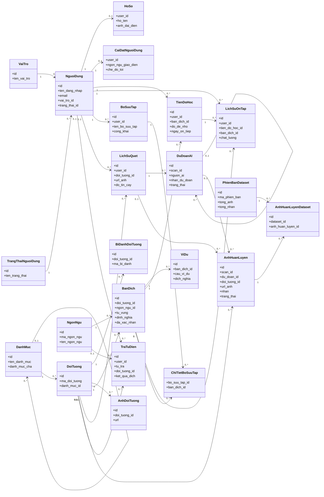
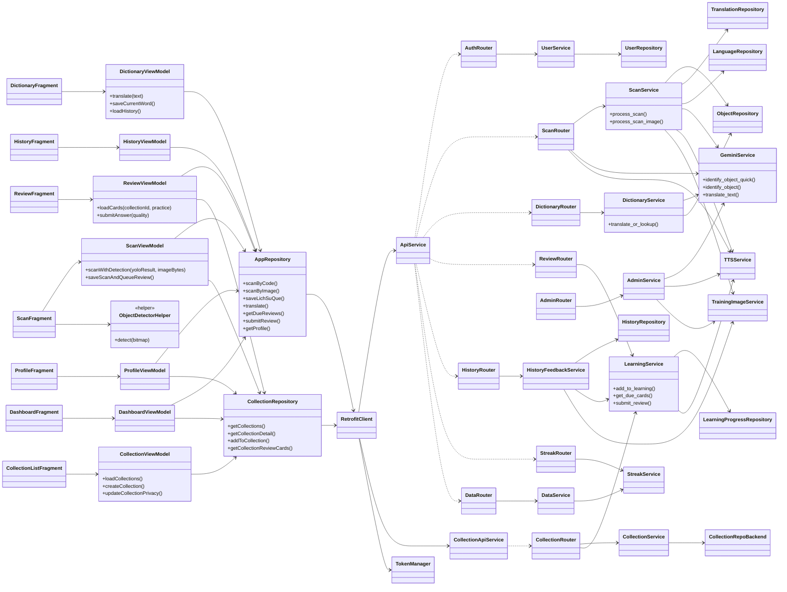
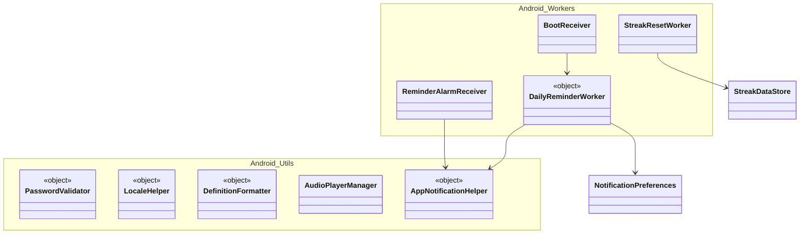
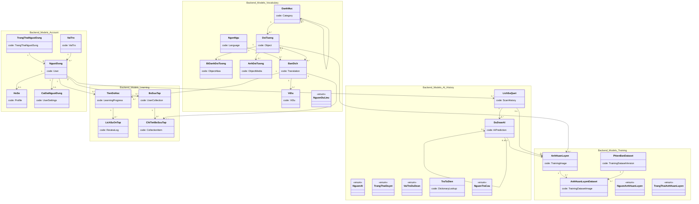
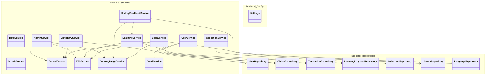
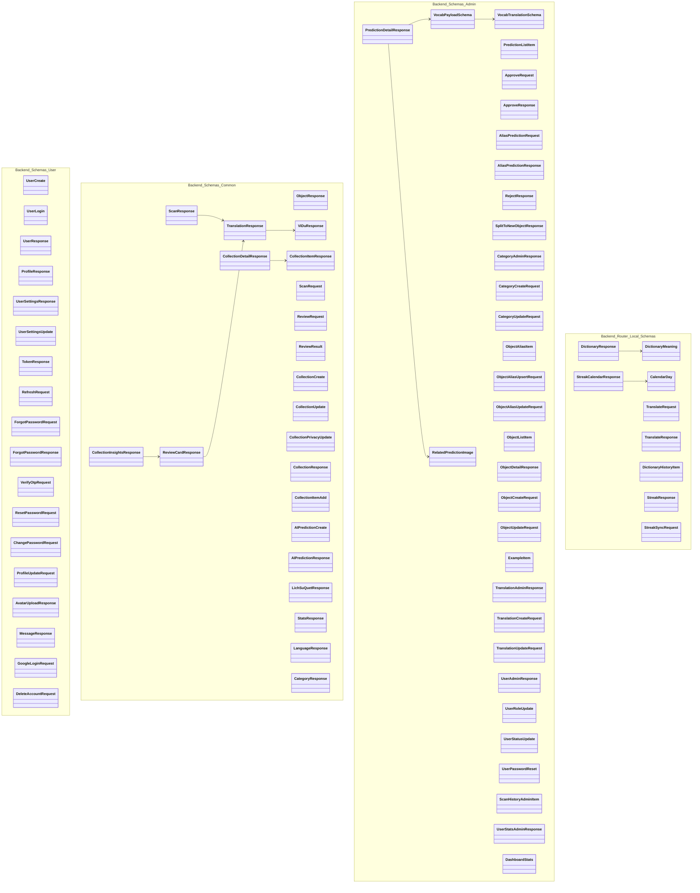
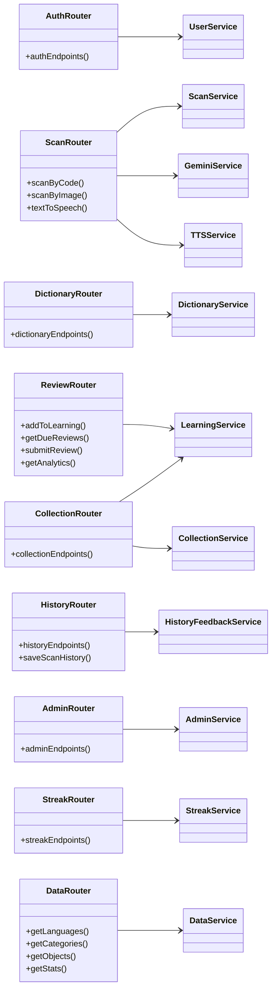

# Object Scanner - Sơ đồ class mức 1 và mức 2

Tài liệu này được dựng từ code hiện tại của project, chủ yếu từ:

- Android: `android/app/src/main/java/com/duc/objectlanguage`
- Backend: `backend/app/models`, `backend/app/services`, `backend/app/routers`, `backend/app/repositories`

Ghi chú: checkout hiện tại không có thư mục `android/.gsd`, nên sơ đồ ưu tiên code đang tồn tại thay vì tài liệu GSD cũ.

## 1. Sơ đồ class mức 1 - domain cốt lõi

Mức 1 thể hiện các bảng/class nghiệp vụ chính bằng đúng tên bảng trong DB và chỉ giữ các thuộc tính quan trọng nhất. Mức 2 bên dưới mới bung đầy đủ kiểu dữ liệu, PK/FK, timestamp và soft-delete.

## 2. Sơ đồ class mức 2 - chi tiết bảng DB

Mức 2 bung đầy đủ field chính theo SQLAlchemy model hiện tại. Tên class vẫn là tên bảng tiếng Việt trong DB; dòng `code:` ghi class backend tương ứng.

```mermaid
classDiagram
direction TB

class VaiTro {
  code: VaiTro
  +id : INT PK
  +ten_vai_tro : VARCHAR_50
}

class TrangThaiNguoiDung {
  code: TrangThaiNguoiDung
  +id : INT PK
  +ten_trang_thai : VARCHAR_50
}

class NguoiDung {
  code: User
  +id : INT PK
  +ten_dang_nhap : VARCHAR_50
  +email : VARCHAR_100
  +email_da_xac_thuc : BOOLEAN
  +mat_khau_ma_hoa : VARCHAR_255
  +vai_tro_id : INT FK
  +trang_thai_id : INT FK
  +lan_dang_nhap_cuoi : DATETIME
  +ngay_tao : TIMESTAMP
  +ngay_cap_nhat : TIMESTAMP
  +thoi_gian_xoa : DATETIME
}

class HoSo {
  code: Profile
  +user_id : INT PK_FK
  +ho_ten : VARCHAR_100
  +anh_dai_dien : VARCHAR_255
  +gioi_thieu : VARCHAR_500
}

class CaiDatNguoiDung {
  code: UserSettings
  +user_id : INT PK_FK
  +ngon_ngu_giao_dien : VARCHAR_10
  +che_do_toi : BOOLEAN
}

class DanhMuc {
  code: Category
  +id : INT PK
  +ten_danh_muc : VARCHAR_100
  +danh_muc_cha : INT FK
  +mo_ta : TEXT
  +thoi_gian_xoa : DATETIME
}

class DoiTuong {
  code: Object
  +id : INT PK
  +danh_muc_id : INT FK
  +ma_doi_tuong : VARCHAR_100
  +tao_boi : INT FK
  +thoi_gian_xoa : DATETIME
}

class BiDanhDoiTuong {
  code: ObjectAlias
  +id : INT PK
  +doi_tuong_id : INT FK
  +ma_bi_danh : VARCHAR_100
  +ten_hien_thi : VARCHAR_255
  +ngon_ngu : VARCHAR_10
  +thoi_gian_tao : TIMESTAMP
}

class AnhDoiTuong {
  code: ObjectMedia
  +id : INT PK
  +doi_tuong_id : INT FK
  +url : VARCHAR_255
  +doi_tuong_chinh : BOOLEAN
  +thoi_gian_xoa : DATETIME
}

class NgonNgu {
  code: Language
  +id : INT PK
  +ma_ngon_ngu : VARCHAR_10
  +ten_ngon_ngu : VARCHAR_50
  +icon_co : VARCHAR_255
  +dang_hoat_dong : BOOLEAN
}

class BanDich {
  code: Translation
  +id : INT PK
  +doi_tuong_id : INT FK
  +ngon_ngu_id : INT FK
  +tu_vung : VARCHAR_255
  +phien_am : VARCHAR_255
  +loai_tu : VARCHAR_50
  +dinh_nghia : TEXT
  +am_thanh_url : VARCHAR_255
  +nguon_du_lieu : ENUM
  +da_xac_nhan : BOOLEAN
  +ngay_tao : TIMESTAMP
  +thoi_gian_xoa : DATETIME
}

class ViDu {
  code: ViDu
  +id : INT PK
  +ban_dich_id : INT FK
  +cau_vi_du : TEXT
  +dich_nghia : TEXT
  +nguon_du_lieu : VARCHAR_50
}

class TienDoHoc {
  code: LearningProgress
  +id : BIGINT PK
  +user_id : INT FK
  +ban_dich_id : INT FK
  +do_de_nho : DECIMAL_5_2
  +khoang_lap : INT
  +so_lan_lap : INT
  +ngay_on_tiep : DATETIME
  +lan_on_cuoi : DATETIME
}

class LichSuOnTap {
  code: ReviewLog
  +id : BIGINT PK
  +user_id : INT FK
  +tien_do_hoc_id : BIGINT FK
  +ban_dich_id : INT FK
  +chat_luong : INT
  +thoi_diem_on : DATETIME
  +khoang_lap_cu : INT
  +khoang_lap_moi : INT
  +do_de_nho_cu : DECIMAL_5_2
  +do_de_nho_moi : DECIMAL_5_2
  +so_lan_lap_cu : INT
  +so_lan_lap_moi : INT
  +ngay_on_tiep : DATETIME
}

class BoSuuTap {
  code: UserCollection
  +id : INT PK
  +user_id : INT FK
  +ten_bo_suu_tap : VARCHAR_100
  +cong_khai : BOOLEAN
  +ngay_tao : TIMESTAMP
  +thoi_gian_xoa : DATETIME
}

class ChiTietBoSuuTap {
  code: CollectionItem
  +bo_suu_tap_id : INT PK_FK
  +ban_dich_id : INT PK_FK
}

class LichSuQuet {
  code: ScanHistory
  +id : INT PK
  +user_id : INT FK
  +doi_tuong_id : INT FK
  +url_anh : VARCHAR_255
  +do_tin_cay : FLOAT
  +thoi_gian : TIMESTAMP
}

class DuDoanAI {
  code: AIPrediction
  +id : INT PK
  +scan_id : INT FK
  +nguon_ai : ENUM
  +nhan_du_doan : VARCHAR_255
  +do_tin_cay : FLOAT
  +mo_ta : TEXT
  +trang_thai : ENUM
  +vai_tro : ENUM
  +du_doan_goc_id : INT FK
  +thoi_gian : TIMESTAMP
}

class AnhHuanLuyen {
  code: TrainingImage
  +id : INT PK
  +scan_id : INT FK
  +du_doan_id : INT FK
  +doi_tuong_id : INT FK
  +url_anh : VARCHAR_255
  +nhan : VARCHAR_255
  +nguon_du_lieu : ENUM
  +do_tin_cay : FLOAT
  +diem_chat_luong : INT
  +trang_thai : ENUM
  +nguoi_duyet_id : INT FK
  +thoi_gian_tao : TIMESTAMP
  +thoi_gian_duyet : DATETIME
  +ghi_chu : TEXT
  +thoi_gian_xoa : DATETIME
}

class PhienBanDataset {
  code: TrainingDatasetVersion
  +id : INT PK
  +ma_phien_ban : VARCHAR_100
  +mo_ta : TEXT
  +tong_anh : INT
  +tong_nhan : INT
  +thoi_gian_tao : TIMESTAMP
  +ghi_chu : TEXT
}

class AnhHuanLuyenDataset {
  code: TrainingDatasetImage
  +id : INT PK
  +dataset_id : INT FK
  +anh_huan_luyen_id : INT FK
  +thoi_gian_tao : TIMESTAMP
}

class TraTuDien {
  code: DictionaryLookup
  +id : INT PK
  +user_id : INT FK
  +tu_tra : VARCHAR_255
  +ngon_ngu_tra_id : INT FK
  +doi_tuong_id : INT FK
  +nguon_du_lieu : ENUM
  +lan_tra_cuoi : TIMESTAMP
  +ket_qua_dich : VARCHAR_500
  +phien_am : VARCHAR_100
  +den_ngon_ngu_id : INT FK
}

VaiTro "1" --> "0..*" NguoiDung : vai_tro_id
TrangThaiNguoiDung "1" --> "0..*" NguoiDung : trang_thai_id
NguoiDung "1" --> "0..1" HoSo : user_id
NguoiDung "1" --> "0..1" CaiDatNguoiDung : user_id
NguoiDung "1" --> "0..*" BoSuuTap : user_id
NguoiDung "1" --> "0..*" TienDoHoc : user_id
NguoiDung "1" --> "0..*" LichSuQuet : user_id
NguoiDung "1" --> "0..*" LichSuOnTap : user_id
NguoiDung "0..1" --> "0..*" TraTuDien : user_id
NguoiDung "0..1" --> "0..*" AnhHuanLuyen : nguoi_duyet_id

DanhMuc "0..1" --> "0..*" DanhMuc : danh_muc_cha
DanhMuc "1" --> "0..*" DoiTuong : danh_muc_id
DoiTuong "1" --> "0..*" BiDanhDoiTuong : doi_tuong_id
DoiTuong "1" --> "0..*" AnhDoiTuong : doi_tuong_id
DoiTuong "1" --> "0..*" BanDich : doi_tuong_id
DoiTuong "0..1" --> "0..*" LichSuQuet : doi_tuong_id
DoiTuong "0..1" --> "0..*" AnhHuanLuyen : doi_tuong_id
DoiTuong "0..1" --> "0..*" TraTuDien : doi_tuong_id

NgonNgu "1" --> "0..*" BanDich : ngon_ngu_id
NgonNgu "0..1" --> "0..*" TraTuDien : ngon_ngu_tra_id
NgonNgu "0..1" --> "0..*" TraTuDien : den_ngon_ngu_id
BanDich "1" --> "0..*" ViDu : ban_dich_id
BanDich "1" --> "0..*" TienDoHoc : ban_dich_id
BanDich "1" --> "0..*" ChiTietBoSuuTap : ban_dich_id
BanDich "1" --> "0..*" LichSuOnTap : ban_dich_id

BoSuuTap "1" --> "0..*" ChiTietBoSuuTap : bo_suu_tap_id
TienDoHoc "1" --> "0..*" LichSuOnTap : tien_do_hoc_id
LichSuQuet "1" --> "0..*" DuDoanAI : scan_id
DuDoanAI "0..1" --> "0..*" DuDoanAI : du_doan_goc_id
LichSuQuet "0..1" --> "0..*" AnhHuanLuyen : scan_id
DuDoanAI "0..1" --> "0..*" AnhHuanLuyen : du_doan_id
PhienBanDataset "1" --> "0..*" AnhHuanLuyenDataset : dataset_id
AnhHuanLuyen "1" --> "0..*" AnhHuanLuyenDataset : anh_huan_luyen_id
```

## 3. Sơ đồ bổ sung - lớp điều phối nghiệp vụ

Phần này nối các màn hình Android với repository, API interface và service backend tương ứng.

## 4. Ghi chú nghiệp vụ để đọc sơ đồ

- `LichSuQuet` là nhật ký mỗi lần quét.
- `DuDoanAI` là hàng đợi kiểm duyệt kết quả AI/Gemini, trạng thái chính là `cho_duyet`, `da_duyet`, `tu_choi`.
- `AnhHuanLuyen` là kho ảnh ứng viên cho training YOLO, có thể bắt nguồn từ scan hoặc từ dự đoán AI.
- `PhienBanDataset` và `AnhHuanLuyenDataset` dùng để gom các ảnh training đã duyệt thành phiên bản dataset có thể export/retrain về sau.
- `TienDoHoc` lưu trạng thái SM-2 hiện tại của từng từ đã học; `LichSuOnTap` là log sự kiện ôn tập và là nguồn đúng cho streak/analytics.
- Android không gọi trực tiếp database. Android đi qua `RetrofitClient`, `ApiService` hoặc `CollectionApiService`, sau đó backend router gọi service/repository/model.
- Luồng xác thực là `TokenManager` lưu access/refresh token, `RetrofitClient` gắn `Authorization: Bearer ...` vào request, và authenticator gọi `/api/auth/refresh` khi token hết hạn.
- `ObjectDetectorHelper.COCO_MODEL` và `ObjectDetectorHelper.CUSTOM_MODEL` là constant trong companion object, không phải field instance của từng helper.
- Sơ đồ entity ở mục 2 cố ý giữ đầy đủ quan hệ nên khá dày; khi trình chiếu nên dùng phụ lục 6 hoặc export SVG rồi phóng to.

## 5. Phụ lục đầy đủ - Android classes

Phần này liệt kê đầy đủ các class, object, interface, enum và data class Kotlin đang có trong `android/app/src/main/java/com/duc/objectlanguage`.

```mermaid
classDiagram
direction TB

namespace App_Root {
  class ObjectLanguageApp
  class MainActivity
}

namespace Data_API {
  class ApiService {
    <<interface>>
  }
  class CollectionApiService {
    <<interface>>
  }
  class RetrofitClient {
    <<object>>
  }
}

namespace Data_Local {
  class ApiConfig {
    <<object>>
  }
  class TokenManager
  class GuestSessionManager
  class NotificationPreferences
  class NotificationSettings {
    <<data>>
  }
  class StreakDataStore
}

namespace Data_Repository {
  class AppRepository
  class CollectionRepository
}

namespace Data_Model_Core {
  class LoginRequest {
    <<data>>
  }
  class GoogleLoginRequest {
    <<data>>
  }
  class RegisterRequest {
    <<data>>
  }
  class RefreshRequest {
    <<data>>
  }
  class ForgotPasswordRequest {
    <<data>>
  }
  class ForgotPasswordResponse {
    <<data>>
  }
  class VerifyOtpRequest {
    <<data>>
  }
  class ResetPasswordRequest {
    <<data>>
  }
  class ChangePasswordRequest {
    <<data>>
  }
  class DeleteAccountRequest {
    <<data>>
  }
  class MessageResponse {
    <<data>>
  }
  class TokenResponse {
    <<data>>
  }
  class UserResponse {
    <<data>>
  }
  class UserSettingsResponse {
    <<data>>
  }
  class UserSettingsUpdate {
    <<data>>
  }
  class ScanRequest {
    <<data>>
  }
  class ScanResponse {
    <<data>>
  }
  class ViDuResponse {
    <<data>>
  }
  class TranslationResponse {
    <<data>>
  }
  class ExamplesResponse {
    <<data>>
  }
  class ReviewRequest {
    <<data>>
  }
  class ReviewCardResponse {
    <<data>>
  }
  class ReviewResult {
    <<data>>
  }
  class StatsResponse {
    <<data>>
  }
  class HistoryItem {
    <<data>>
  }
  class HistoryDetail {
    <<data>>
  }
  class ProgressHistoryItem {
    <<data>>
  }
  class ReviewHistoryItem {
    <<data>>
  }
  class DictionaryResponse {
    <<data>>
  }
  class DictionaryMeaning {
    <<data>>
  }
  class TranslateRequest {
    <<data>>
  }
  class TranslateResponse {
    <<data>>
  }
  class DictionaryHistoryItem {
    <<data>>
  }
  class CategoryData {
    <<data>>
  }
  class ObjectData {
    <<data>>
  }
  class ProfileData {
    <<data>>
  }
  class ProfileUpdateRequest {
    <<data>>
  }
  class AvatarUploadResponse {
    <<data>>
  }
  class StreakResponse {
    <<data>>
  }
  class DailyReview {
    <<data>>
  }
  class MasteryDist {
    <<data>>
  }
  class AnalyticsResponse {
    <<data>>
  }
  class StreakCalendarDay {
    <<data>>
  }
  class StreakCalendarResponse {
    <<data>>
  }
  class StreakSyncRequest {
    <<data>>
  }
  class LichSuQuetResponse {
    <<data>>
  }
}

namespace Data_Model_Collection {
  class Collection {
    <<data>>
  }
  class CollectionDetail {
    <<data>>
  }
  class CollectionItem {
    <<data>>
  }
  class CollectionInsights {
    <<data>>
  }
  class CreateCollectionRequest {
    <<data>>
  }
  class UpdateCollectionRequest {
    <<data>>
  }
  class UpdateCollectionPrivacyRequest {
    <<data>>
  }
  class AddToCollectionRequest {
    <<data>>
  }
}

ObjectLanguageApp --> TokenManager
ObjectLanguageApp --> GuestSessionManager
ObjectLanguageApp --> AppRepository
ObjectLanguageApp --> RetrofitClient
AppRepository --> RetrofitClient
AppRepository --> ApiService
CollectionRepository --> RetrofitClient
CollectionRepository --> CollectionApiService
RetrofitClient --> TokenManager
```

```mermaid
classDiagram
direction TB

namespace UI_Auth {
  class LoginFragment
  class RegisterFragment
  class ForgotPasswordFragment
  class VerifyOtpFragment
  class ResetPasswordFragment
}

namespace UI_Dashboard {
  class DashboardFragment
  class DashboardViewModel
  class DashboardStreakSummary {
    <<data>>
  }
  class DashboardSuggestion {
    <<data>>
  }
  class CollectionHighlight {
    <<data>>
  }
}

namespace UI_Analytics {
  class AnalyticsFragment
  class AnalyticsViewModel
}

namespace UI_Streak {
  class StreakFragment
  class StreakViewModel
  class StreakData {
    <<data>>
  }
}

namespace UI_Scan {
  class ScanFragment
  class ScanViewModel
  class ObjectDetectorHelper
  class DetectionResult {
    <<data>>
  }
  class DetectionEvent {
    <<sealed interface>>
  }
  class ExampleItem {
    <<data>>
  }
}

namespace UI_Dictionary {
  class DictionaryFragment
  class DictionaryViewModel
  class DictionaryHistoryAdapter
  class DictionaryHistoryListBottomSheet
  class DictionaryHistoryDetailBottomSheet
}

namespace UI_Explore {
  class ExploreFragment
  class ExploreViewModel
  class CategoryDetailFragment
  class CategoryDetailViewModel
  class CategoryAdapter
  class ObjectAdapter
}

namespace UI_History {
  class HistoryFragment
  class HistoryViewModel
  class HistoryDetailFragment
  class HistoryDetailViewModel
  class HistoryAdapter
}

namespace UI_Collection {
  class CollectionListFragment
  class CollectionDetailFragment
  class CollectionInsightsFragment
  class CollectionViewModel
  class CollectionInsightsViewModel
  class CollectionAdapter
  class PublicCollectionAdapter
  class CollectionWordAdapter
  class SaveToCollectionBottomSheet
}

namespace UI_Profile_Settings {
  class ProfileFragment
  class ProfileViewModel
  class NotificationSettingsFragment
}

namespace UI_Review {
  class ReviewFragment
  class ReviewViewModel
  class ReviewSessionSummary {
    <<data>>
  }
  class QuizFragment
  class QuizViewModel
  class QuizQuestion {
    <<data>>
  }
  class AnswerResult {
    <<data>>
  }
  class TypingTestFragment
  class TypingTestViewModel
  class TypingQuestion {
    <<data>>
  }
  class TypingAnswerResult {
    <<data>>
  }
  class ListeningTestFragment
  class ListeningTestViewModel
  class ListeningQuestion {
    <<data>>
  }
  class ListeningAnswerResult {
    <<data>>
  }
  class ImageMatchingFragment
  class ImageMatchingViewModel
  class MatchingCard {
    <<data>>
  }
  class CardType {
    <<enum>>
  }
  class MatchingCardAdapter
  class PronunciationFragment
  class PronunciationViewModel
  class PronunciationWord {
    <<data>>
  }
  class PronunciationResult {
    <<data>>
  }
}

namespace UI_Other {
  class OnboardingFragment
  class OnboardingPagerAdapter
  class OnboardingSlide {
    <<data>>
  }
  class GuestUpsellDialog {
    <<object>>
  }
}

LoginFragment --> AppRepository
RegisterFragment --> AppRepository
ForgotPasswordFragment --> AppRepository
VerifyOtpFragment --> AppRepository
ResetPasswordFragment --> AppRepository

DashboardFragment --> DashboardViewModel
DashboardViewModel --> AppRepository
DashboardViewModel --> CollectionRepository

AnalyticsFragment --> AnalyticsViewModel
AnalyticsViewModel --> AppRepository

StreakFragment --> StreakViewModel
StreakViewModel --> AppRepository

ScanFragment --> ScanViewModel
ScanFragment --> ObjectDetectorHelper
ScanViewModel --> AppRepository
ScanViewModel --> CollectionRepository

DictionaryFragment --> DictionaryViewModel
DictionaryViewModel --> AppRepository

ExploreFragment --> ExploreViewModel
CategoryDetailFragment --> CategoryDetailViewModel
ExploreViewModel --> AppRepository
CategoryDetailViewModel --> AppRepository

HistoryFragment --> HistoryViewModel
HistoryDetailFragment --> HistoryDetailViewModel
HistoryViewModel --> AppRepository
HistoryDetailViewModel --> AppRepository
HistoryDetailViewModel --> CollectionRepository

CollectionListFragment --> CollectionViewModel
CollectionDetailFragment --> CollectionViewModel
CollectionInsightsFragment --> CollectionInsightsViewModel
CollectionViewModel --> CollectionRepository
CollectionInsightsViewModel --> CollectionRepository
SaveToCollectionBottomSheet --> CollectionRepository

ProfileFragment --> ProfileViewModel
ProfileViewModel --> AppRepository
ProfileViewModel --> CollectionRepository

ReviewFragment --> ReviewViewModel
QuizFragment --> QuizViewModel
TypingTestFragment --> TypingTestViewModel
ListeningTestFragment --> ListeningTestViewModel
ImageMatchingFragment --> ImageMatchingViewModel
PronunciationFragment --> PronunciationViewModel
ReviewViewModel --> AppRepository
ReviewViewModel --> CollectionRepository
QuizViewModel --> AppRepository
TypingTestViewModel --> AppRepository
ListeningTestViewModel --> AppRepository
ImageMatchingViewModel --> AppRepository
PronunciationViewModel --> AppRepository
```

## 6. Phụ lục đầy đủ - Backend classes

Phần này liệt kê đầy đủ các class Python chính trong `backend/app`: SQLAlchemy models, enum, Pydantic schemas, services, repositories, router-local schemas và config.

## 7. Danh sách endpoint-router-service đầy đủ ở mức class

Các router FastAPI không khai báo class riêng, nhưng trong sơ đồ lớp có thể biểu diễn như boundary/controller class để đọc kiến trúc.

## 8. Ghi chú về độ đầy đủ

- Sơ đồ mức 1 và mức 2 ở trên là bản dùng để trình bày chính.
- Trong sơ đồ mức 2, kiểu như `VARCHAR_100`, `DECIMAL_5_2`, `PK_FK` được viết bằng dấu gạch dưới để Mermaid render ổn định; chúng tương ứng với `VARCHAR(100)`, `DECIMAL(5,2)`, và khóa chính kiêm khóa ngoại.
- Các phụ lục 5, 6, 7 là bản đầy đủ theo class hiện có trong code.
- Với các DTO/schema cùng tên ở Android và backend, phụ lục tách thành từng block Mermaid riêng để tránh trùng tên class khi render.
- Các router FastAPI là module/function endpoint trong code, không phải class Python thật; tài liệu biểu diễn chúng như controller/boundary class vì đây là cách đọc UML phổ biến cho web API.
- Một số file Kotlin/Python chỉ chứa hàm top-level nên không xuất hiện như class UML, ví dụ: `userFacingException`, `resolveMediaUrl`, `localizedString`, các extension trong `ViewExt.kt`, `now_vietnam`, `calculate_sm2`, `compress_image`, `read_upload_bytes`, các hàm security JWT/password.
